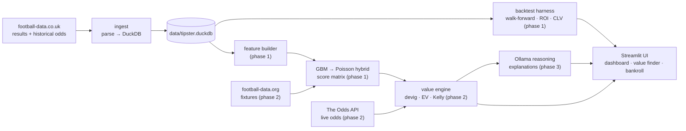

# Design — AI-Powered Football Tipster

> A value-betting engine for European football: calibrated match
> probabilities from a GBM → Poisson hybrid, compared against bookmaker odds
> to surface positive-EV tips, explained by a local LLM, and delivered
> through a Streamlit dashboard.

## Why this exists

Two goals, in priority order:

1. **A portfolio-grade end-to-end ML system** — data ingestion, feature
   engineering, probabilistic modeling, calibration, backtesting, LLM
   reasoning, and a live UI in one well-engineered repo.
2. **A personal paper-trading tool** that finds and tracks value bets,
   judged honestly by closing-line value rather than short-term profit.

The honest framing is in the product's DNA: profit is the bonus, calibration
and CLV are the scoreboard.

## Core principle: price, don't predict

Bookmakers are already excellent at predicting football; the closing line is
close to the true probability. Competing on prediction alone loses to the
margin. So the engine's job is pricing — finding disagreements worth money:

- Bookmaker odds imply a probability (`1 / odds`); the sum across outcomes
  exceeds 1 by the overround (the margin). Remove it (Shin's method) to get
  the market's fair probability.
- Our model produces its own probability per outcome.
- Expected value: `EV = p_model × odds − 1`. A tip is only surfaced when EV
  clears a threshold, with stakes sized by fractional Kelly.

Everything downstream — the model choice, the metrics, the UI — serves this
comparison between two probability estimates.

## System overview

| Component | Location | Phase |
|-----------|----------|-------|
| Ingest + storage | `packages/tipster-core` | 0 (done) |
| Feature builder | `packages/tipster-core` | 1 |
| Model (GBM → Poisson hybrid) | `packages/tipster-core` | 1 |
| Backtest harness | `packages/tipster-core` | 1 |
| Value engine (devig, EV, Kelly) | `packages/tipster-core` | 2 |
| Streamlit UI | `apps/tipster-ui` | 0 (status page) → 2 |
| Predictor service (fixtures) | `services/predictor` | 2–3 |
| Reasoning layer | `packages/tipster-core` + Ollama | 3 |
| Kenya local-book comparison | UI + value engine | 4 |

## Data sources

| Source | Provides | Access | Cost | Phase |
|--------|----------|--------|------|-------|
| football-data.co.uk | Results, stats, opening/closing odds (B365, Pinnacle, Avg, Max) | CSV download | Free | 0 |
| The Odds API | Live odds (Betway + majors) | REST, `THE_ODDS_API_KEY` | Free tier | 2 |
| football-data.org v4 | Fixtures, lineups | REST, `FOOTBALL_DATA_API_KEY` | Free tier | 2 |
| Understat / FBref | xG by match and player | Scraping/API | Free | 1+ (deferred) |
| Local books (Sportybet, Odibets) | Kenyan odds for comparison | Manual snapshots via UI | Free | 4 |

Data lands in DuckDB (`data/tipster.duckdb`); raw CSVs are cached under
`data/raw/`. `data/` is gitignored — the repo ships code, never data.

## Data model

The `matches` table (one row per played match) carries identity
(`league`, `season`, `date`, `home_team`, `away_team`), the result
(`home_goals`, `away_goals`), and 24 odds columns: four price sources
(Bet365, Pinnacle, market average, market max) × two points in time
(opening, closing) × three outcomes (home, draw, away). Odds columns are
nullable — older seasons lack some sources — and any value ≤ 1.0 is treated
as missing. Ingest is idempotent per (league, season): re-running replaces
that season's rows.

Pydantic contracts in `tipster_core.contracts` (`MatchResult`, `MatchOdds`,
`OutcomeOdds`) define the canonical domain objects consumed by later phases.

## Modeling approach

Summarised from [ADR 0003](decisions/0003-model-gbm-poisson-hybrid.md):
LightGBM predicts each team's expected goals from engineered features; a
Poisson layer with the Dixon-Coles low-score correction turns the two
lambdas into a scoreline probability matrix; every market probability is
derived exactly from that matrix; isotonic calibration sits on top. Elo
pools are per-league. A pure Dixon-Coles reference implementation is kept as
the benchmark the hybrid must beat.

## Evaluation and metrics

- **Walk-forward validation** is the only accepted protocol: train on the
  past, predict the next gameweek, roll forward. No random splits — leakage
  in sports data is silent and fatal.
- **Brier score and log loss** per market family (probabilistic quality).
- **Calibration curves** per market (reliability diagrams).
- **Flat-stake ROI** over the walk-forward window (profitability).
- **Closing line value (CLV)** versus Pinnacle closing odds — the
  industry-standard proof of edge, measurable in weeks. A strategy that
  beats the closing line consistently is sharp even when short-term P/L is
  noisy.

## Staking

Fractional Kelly (quarter-Kelly default) on positive-EV tips, with a
per-bet cap; flat staking runs alongside as the control arm. Everything is
paper-traded and logged (SQLite bet log, phase 2) until CLV says otherwise.

## Scope for v1

- **Leagues:** the big five European leagues (`E0, SP1, D1, I1, F1`) are
  the backtest default. Since ADR 0011, about 40 competitions are
  ingested and priceable: 22 football-data.co.uk divisions, 16 "extra"
  countries (Brazil, USA, Japan, …), and national teams (`INT`: World Cup,
  Euros, AFCON, Copa América, qualifiers, Nations League), with
  neutral-venue handling.
- **Markets:** 1X2, over/under 2.5, BTTS, correct score — all derived from
  one score matrix.
- **Kenya angle:** compare sharp-line-calibrated prices against local book
  odds entered as manual snapshots (phase 4).

## Roadmap

| Phase | Delivers | Status |
|-------|----------|--------|
| 0 | Repo scaffold, ingest → DuckDB, contracts, UI status page | Done |
| 1 | Feature builder, hybrid model, calibration, backtest harness | Next |
| 2 | Value engine, live odds, Streamlit value finder + bet log | Planned |
| 3 | Predictor service port, Ollama reasoning layer | Planned |
| 4 | All leagues live, CLV tracking, Kenya local-book comparison | Planned |

## Risks and mitigations

| Risk | Mitigation |
|------|------------|
| PL is hyper-efficient; no edge exists | Judge by CLV, not early P/L; paper trade; soft books and niche markets are the realistic edge |
| Data drift (column formats change by season) | Parser treats odds columns as optional; ingest validated by tests with fixtures |
| Overfitting the backtest | Walk-forward only; benchmark against Dixon-Coles and market baselines |
| Licensing/ToS | Runtime ingestion, no data in git, APIs for live odds; scraping deferred and decided separately |
| LLM hallucination in tips | Numbers are injected, never generated by the LLM; template fallback |

## Non-goals

No automated bet placement. No "guaranteed" tips — outputs are probabilities
and EV, explicitly not betting advice. No player props or in-play markets in
v1.
